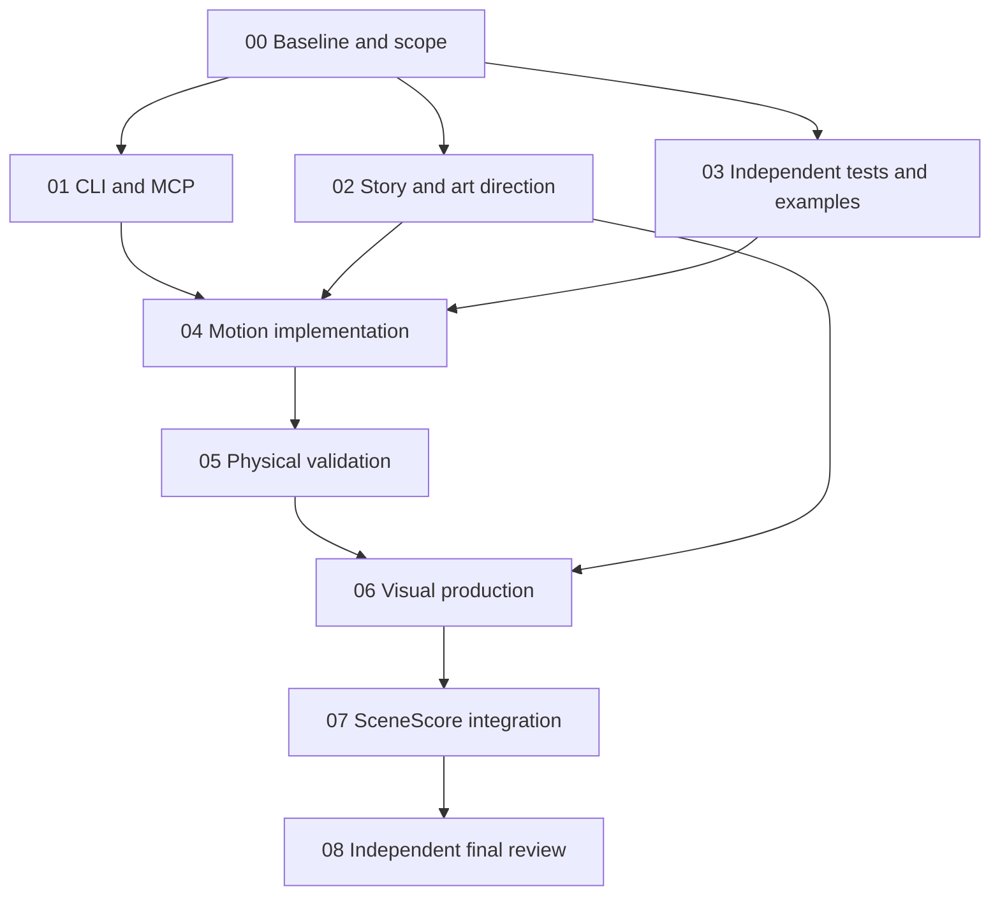

# SceneScore: Blender production revamp

Unzip this folder into the existing repository as `planning/blender_revamp/`. Start Codex in that repository and paste `BOOTSTRAP.txt`. The coordinator reads `START_HERE.md`, dispatches the focused prompts, and owns integration. The work is implementation plus verified media delivery, with bounded repair loops.

This pack targets the uploaded SceneScore snapshot. It includes source-grounded findings, the original submitted video, three silent failure excerpts, a contact sheet, and analytical positive/negative fixtures. These analytical fixtures are synthetic reference data, not Blender renders or real-world measurements. Codex must build and inspect the corresponding regression scenes locally.

## Included

- `START_HERE.md`, `SHARED_GUARDRAILS.md`, `DAG.json`: execution, scope and shared gates.
- `prompts/00` through `08`: small, dependency-ordered work packets.
- `references/BASELINE_AUDIT.md`: code locations, measurements, uncertainty and failure examples.
- `references/POSITIVE_NEGATIVE_EXAMPLES.md`: concrete story, physics and quality-control examples.
- `references/SOURCES.md`: current upstream references and documentation-access limits.
- `evidence/`: original media, extracted failure clips, sampled frames, metrics and read-only recomputation script.
- `examples/analytic_cases.json`, `examples/check_reference_cases.py`: numerical ground truth and intentionally bad controls. Run the checker with ordinary Python. These checks do not validate Blender.

## Execution graph

Parallelism is optional. Ownership and tool support determine the actual schedule. Repair cycles are recorded separately from this acyclic dependency graph.

## Evidence limits

The author of this pack read the animation/export/validation/integration paths, extracted and inspected sampled video frames, and independently recomputed overlap from supplied evaluated-state records. No local Blender executable was found. No Blender simulation, MCP session, continuous video playback, or audio audition was performed while preparing this pack. No production source file was changed. Existing approval and project-release gates remain separate.
