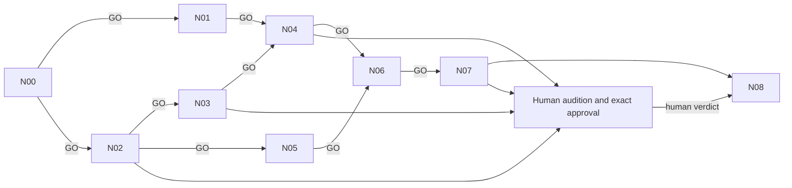

# Music vertical — execution overlay

Load `../../scenescore_hackathon_music_dag/START_HERE.md`, its immutable node prompts, shared guardrails and interface, plus `../../docs/decisions/0011-music-vertical-execution.md`. Input pack checksums remain unchanged. This execution overlay supplies DAG-skill routing and ledger without rewriting supplied inputs.

| ID | Source prompt | Machine gate |
|---|---|---|
| 00 | prompts/00_baseline_freeze_and_slice.md | Green baseline, hashes and ownership freeze |
| 01 | prompts/01_motion_event_semantics.md | Eight analytic types, required positive/negative controls |
| 02 | prompts/02_catalogue_audition_and_repair.md | Exact-duration clean render, ending and safe bars |
| 03 | prompts/03_bounded_transform_vocabulary.md | Typed deterministic transforms and all budget/invariant tests |
| 04 | prompts/04_motion_to_intent_mapping.md | Eight deterministic mappings, distinct near-miss/rebound invariants |
| 05 | prompts/05_harmonic_transition_table.md | 216 entries valid; default edges pass; jazz unreachable |
| 06 | prompts/06_browser_performance_integration.md | Shared submit path, state and timing tests, build |
| 07 | prompts/07_audition_and_timing_measurement.md | Exact candidate measured; unavailable evidence explicitly recorded |
| 08 | prompts/08_independent_gate.md | Independent assessment always runs; human gate must remain open if unheard |

All prompt paths are relative to `../../scenescore_hackathon_music_dag/`. Each source prompt plus this overlay is dispatchable; outputs include the owning handoff and coordinator LEDGER row. Preregistered numeric thresholds are those already supplied in each source prompt, never fitted to results.

GO auto-dispatches eligible dependent nodes in this run. PARK/DEAD/ESCALATE stop only the affected branch; route bounded repairs to owners. HUMAN-DECISION pauses the human-only subgate while independent draft and fixture nodes continue. Approval requires exact prepared bytes and a human; prior automated approval rejection remains binding. No external effects or spending are planned. Such a newly required boundary must be resolved against existing user authorization before proceeding. Final release ceiling is PIPELINE_TESTED_ONLY with honest AUDITION_PENDING when applicable.
